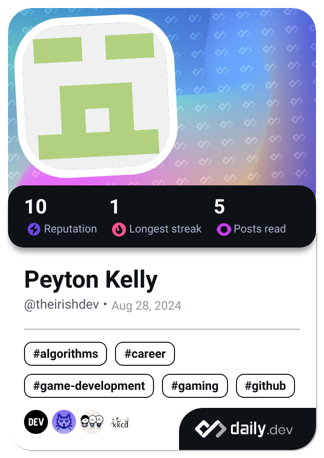

Hello. My name is Peyton Kelly. At the time of writing this, im a 16 y/o C/C++ and Fortran dev from Pa working from a school computer.
Coding and computer science have been my passion since I started highschool and it hasn't gone away since. I hope that my Fortran IDE will be complete and
available to everyone some day.

If you have anything to say to me, good or bad, you can reach me at peytonk1945@gmail.com!

<!---
peytonk132/peytonk132 is a ✨ special ✨ repository because its `README.md` (this file) appears on your GitHub profile.
You can click the Preview link to take a look at your changes.
--->
